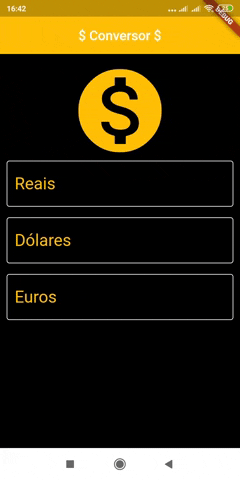

# Conversor de Moedas

Projeto em Flutter utilizando a API do [HG Finance](https://hgbrasil.com/status/finance) para realizar a cotação das moedas em relação ao Real para Dólar (USD) e Euro (EUR).

## Clonar repositório

`` git clone https://github.com/thiagosr135/conversor_moedas.git ``

## Adquirir a chave da API

`` https://console.hgbrasil.com/keys/new_key_plan ``

## Autor
* **Thiago de Souza Ribeiro** - [thiagosr135](https://github.com/thiagosr135)
